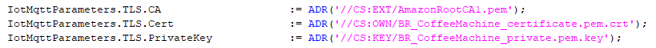
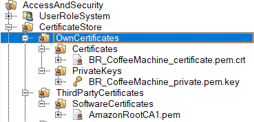
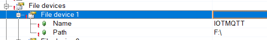
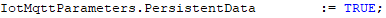

# paho.mqtt.c-ar
MQTT Client Library for Automation Runtime based on eclipse/paho.mqtt.c

## Introduction

This repository includes compiled binary MQTT client libraries for Automation Runtime. The libraries are based on 
- OpenSSL 1.1.1g
- paho.mqtt.c 1.3.5

The libraries come in two different forms

- IotMqtt

    IotMqtt is a Function Block based Library with Publish and Subscribe functionality that enables easy usage within
    the CYCLIC IEC environment. Basically this is what you need when you want to communicate with a broker using MQTT.
    The client is base on the `MQTTAsync` which is capable of running multiple simultaneous connections on the same
    PLC.


- PahoMQTT

    PahoMQTT is the static library with direct access to the paho.mqtt.c API which is used by the IotMqtt library as a driver. 
    The PahoMQTT library should only be used in special cases, where you need to enable special commands from the mqtt stack.
    It offers basic compatibility for projects that have previously been using PahoMQTT from the 
    https://github.com/br-automation-com/PahoMQTT_Library repository, whereas some minor modifications are needed for these
    applications. Please see Compatibility with Older PahoMQTT versions for more info on this.


## Version Information

The libraries have been built for following runtime versions:
- A4.73 Intel / ARM
- C4.63 Intel / ARM
- D4.53 Intel / ARM
- N4.34 Intel / ARM
- M4.26 Intel
- H3.10 Intel

All Library versions come with the same version as the AR they are built for, whereas `ArSim` versions have the last version
number `.1`, like `4.73.1` and PC targets (with more than 128 sockets) have the last version number `.9`, like `4.73.9`.
These version have no strict dependency on that very AR version, but you should try to use a Library version as close to the 
AR version as possible.

### Releases

- rev.01
    First release


## Using IotMqtt

The IotMqtt enables simple usage within IEC programs. It consists on 3 different types of Function Blocks:

- Client
- Publisher
- Subscriber

Everytime a new connection with a MQTT broker is desired, an IotMqttClient FUB must be used. Then, depending on the pubish/subscribe needs, it is possible to associate from 0 to 50 IotMqttPublish or IotMqttSubscribe FUBs.

Here are some simple samples. Before running them,**it is important to change the ClientID** parameter to a customized one, since the **ClientID must be unique** in the broker.

- Publish sample

  ```
  PROGRAM _CYCLIC
  	IotMqttParameters.ServerUri				:= 'broker.hivemq.com';
  	IotMqttParameters.Port					:= 1883;
  	IotMqttParameters.ClientID				:= 'B&R_SimplePublishSample';
  	 
  	IotMqttClient_0.Enable					:= TRUE;
  	IotMqttClient_0.Connect					:= TRUE;
  	IotMqttClient_0.IotMqttLink 			:= ADR(IotMqttLink);
  	IotMqttClient_0.Parameters				:= IotMqttParameters;
  	IotMqttClient_0();
  	
  	PublishMessage 							:= 'This is a sample message being sent';
  	IotMqttPublish_0.Enable					:= TRUE;
  	IotMqttPublish_0.IotMqttLink			:= IotMqttClient_0.IotMqttLink;
  	IotMqttPublish_0.Topic					:= ADR('B&R_TestTopic/SimplePublishSample');
  	IotMqttPublish_0.Buffer					:= ADR(PublishMessage);
  	IotMqttPublish_0.BufferLength			:= brsstrlen(ADR(PublishMessage));
  	IotMqttPublish_0();
  END_PROGRAM
  
  PROGRAM _EXIT
  	IotMqttClient_0(Enable := FALSE);
  	IotMqttPublish_0(Enable := FALSE); 
  END_PROGRAM
  ```

  

- Subscribe:

  ```
  PROGRAM _CYCLIC
  	IotMqttParameters.ServerUri				:= 'broker.hivemq.com';
  	IotMqttParameters.Port					:= 1883;
  	IotMqttParameters.ClientID				:= 'B&R_SimpleSubscribeSample';
  	 
  	IotMqttClient_0.Enable					:= TRUE;
  	IotMqttClient_0.Connect					:= TRUE;
  	IotMqttClient_0.IotMqttLink 			:= ADR(IotMqttLink);
  	IotMqttClient_0.Parameters				:= IotMqttParameters;
  	IotMqttClient_0();
  
  	IotMqttSubscribe_0.Enable 				:= TRUE;
  	IotMqttSubscribe_0.IotMqttLink			:= IotMqttClient_0.IotMqttLink; 
  	IotMqttSubscribe_0.Topic				:= ADR('B&R_TestTopic/SimpleSubscribeSample');
  	IotMqttSubscribe_0.RecievedTopic		:= ADR(ReceivedTopic); 
  	IotMqttSubscribe_0.RecievedTopicSize	:= SIZEOF(ReceivedTopic);
  	IotMqttSubscribe_0.QueueSize 			:= 50;
  	IotMqttSubscribe_0.Buffer				:= ADR(ReceiveBuffer); 
  	IotMqttSubscribe_0.BufferSize	 		:= SIZEOF(ReceiveBuffer);
  	IotMqttSubscribe_0();
  END_PROGRAM
  
  PROGRAM _EXIT
  	IotMqttClient_0(Enable := FALSE);
  	IotMqttSubscribe_0(Enable := FALSE);
  END_PROGRAM
  ```

  

It is possible to use more than one client, just declare a new IotMqttLink variable, new parameters variable and associate them with a new IotMqttClient FUB. 

### File Devices and Certificates

Some MQTT connections will need to use certificates. They can be stored in the project certificate store or in a user defined File Device.

Depending where they are, we will need to add a prefix to the certificate name in the program. When using the certificate store we will use the following prefixes depending on which container they are:


### 

In case the certificates are stored in the file system, then the prefix is the name of the file device. E.g.


### Logfiles

IotMqtt is able to generate log files to help us diagnose connections or simply keep a register of connection errors. For this functionality, it will use the File Device "IOTMQTT" as default, that the user needs to prepare in the CPU configuration, in the project.



Using the function `IotMqttConfig` in the `_INIT` part of the client program, it is possible to change the default File Device as well as choosing the log level (verbosity), the name of the output file and if we also want log messages to be written in the logger.

This function will only make an effect the first time is called, so it is not possible to adjust those parameters on runtime.

### Persistence

Messages sent or received with QoS (Quality of Service) > 0 have the possibility of being stored in the PLC's flash memory or CF until they have been correctly processed. This will keep messages alive in case of network problems, getting rid of them just when a confirmation of delivery has arrived.

To use this feature it must be enabled  in the client parameters structure. It will use the FileDevice IOTMQTT as default but it can be changed with the function `IotMqttConfig` 



### Samples

Additionally to the Publish and Subscribe samples shown above, more samples are provided inside the Samples directory. There you will find programs the following samples:

- Azure IoT Hub: Connection, publish and subscribe
- Amazon Web Services IoT: Connection, publish and subscribe
- Connection using websockets


## Using PahoMQTT

As mentioned in the Introduction, only use PahoMQTT directly in special circumstances, for legacy reasons or when you need to access the C-API of the paho.mqtt.c directly.
For any other use cases, or new projects, refer to the IotMqtt instead.

### Include Directories

In order to find the headerfiles, set the following `Additional Include Directory` in the `Build Options` of your configuration (Under Project/Change Runtime Versions..)

- **\Logical\Libraries\PahoMQTT\SG4\include**

### Static Linking

The `PahoMQTT` only comes as a static archive, meaning you need to link you task towards
the archive files in the `SG4` or `SG4/Arm` directory of the PahoMQTT library.

Further, and **very important** is that you cannot assign the library to a CPU, as it contains no `.br` file.
Therefore remove it from your CPU configuration if it showed up there, you link directly to the archive file instead.

Archive File Directories:
- **\Logical\Libraries\PahoMQTT\SG4**

Library Archive Files (order of the files is important):

- **V3.10 / GCC4.1.2**: `PahoMQTT_s` `OpenSSL_s` `ar_posix_s` `arsystem` `rtk_lib`
- **V4.26 / GCC4.1.2**: `PahoMQTT_s` `OpenSSL_s` `ar_posix_s` `arsystem` `rtk_lib`
- **V4.34 / GCC4.1.2**: `PahoMQTT_s` `OpenSSL_s` `ar_posix_s` `arsystem` `rtk_lib`
- **V4.53 / GCC6.3.0**: `PahoMQTT_s` `OpenSSL_s` `ar_posix_s` `AR`
- **V4.63 / GCC6.3.0**: `PahoMQTT_s` `OpenSSL_s` `ar_posix_s` `AR`
- **V4.72 / GCC6.3.0**: `PahoMQTT_s` `OpenSSL_s` `ar_posix_s` `AR`
- **V4.73 / GCC6.3.0**: `PahoMQTT_s` `OpenSSL_s` `ar_posix_s` `AR`

### File Devices

Specify a File Device called `CERTS` under CPU Configuration to a Folder that is accesible from AR.

## Compatibility with older PahoMQTT versions

As mentioned in the introduction, the PahoMQTT library offers basic compatibility with older versions of the library.
A benefit with the new version, additional to being built on new paho and openssl sources, is that it also runs on ArSim.
Please see the chapter above (Using PahoMQTT) for basic settings that need to be made when using PahoMQTT.
Four double checking your code, you can find a "converted version" of the `SampleParam` task under `LegacySamples`.

### Function Blocks
As the libary only comes as an archive, the `PahoMQTT_Cyclic` and `PahoMQTT_Init` cannot be declared inside the `.var` file
anymore and need to be declared inside the c-code. Further, the `PahoMQTT.h` is not part of the `<AsDefaults.h>` but need
to be specifically included.

If not already set, you need to `Enable declaration of PLC variables (_GLOBAL, _LOCAL)` in the Project/Settings.

Example:

    #include <bur/plctypes.h>
    #include "PahoMQTT.h"
    
    #ifdef _DEFAULT_INCLUDES
        #include <AsDefault.h>
    #endif
    
    void sample(unsigned long param_adr);
    
    _LOCAL PahoMQTT_Init_typ PahoMQTT_Init_0;
    _LOCAL PahoMQTT_Cyclic_typ PahoMQTT_Cyclic_0;


### File Devices and Certificates

File devices work in the same way as for IotMqtt, with the difference that the former `CERTS` filedevice is used as a default file device,
to maintain compatibility with the former PahoMQTT. If you need to access files from other devices, you should use `//DEVICENAME/path/filename.ext`.

### Logging

If the Logger is activated, the output is no longer directed to the AR logger, but placed inside a `PahoMQTTLog.txt` located under the `CERTS` filedevice.
This logfile uses the standard Paho output file format, and has unix lineendings (LF instead of CRLF). Therefore open the logfile in an editor that can understand
that format, like Notepad++.

If you dont see any logging, even though you have set a high log level, it is probably because you set the loglevel **before** starting the asynchronous thread,
meaning it was started Suspended. In that case, trigger the activation of the log by changing the PahoMQTT_Cyclic_0.LogLevel. Anything above 0 (for example: 1) 
will activate the `PROTOCOL` log. If you really have some debugging issues with your solution and you dont know what is going on, you can activate the 
trace log to see which Paho functions are being called by setting the loglevel to 10, but only do this if youre in trouble - its very verbose.

Example of the `PahoMQTTLog.txt` on LogLevel 1

    =========================================================
                   Trace Output
    =========================================================
    =========================================================
                    Trace Output
    Product name: Eclipse Paho Synchronous MQTT C Client Library
    Version: 1.3.5
    Build level: 2020-09-15 21:58
    OpenSSL version: OpenSSL 1.1.1g  21 Apr 2020
    OpenSSL flags: -DBR_AUTOMATION_RUNTIME
    OpenSSL build timestamp: 2020-09-01
    OpenSSL platform: BR_AUTOMATIONRUNTIME
    OpenSSL directory: OPENSSLDIR: "//OSSLROOT"
    =========================================================
    20201001 114500.061 2176 SamplePara -> PUBLISH msgid: 100 qos: 1 retained: 0 rc 0 payload len(18): Hello World plain!
    20201001 114500.061 2176 SamplePara <- PUBACK msgid: 100
    20201001 114500.361 2176 SamplePara -> PUBLISH msgid: 101 qos: 1 retained: 0 rc 0 payload len(18): Hello World plain!
    20201001 114500.361 2176 SamplePara <- PUBACK msgid: 101
    20201001 114500.681 2176 SamplePara -> PUBLISH msgid: 102 qos: 1 retained: 0 rc 0 payload len(18): Hello World plain!
    20201001 114500.681 2176 SamplePara <- PUBACK msgid: 102
    20201001 114500.981 2176 SamplePara -> PUBLISH msgid: 103 qos: 1 retained: 0 rc 0 payload len(18): Hello World plain!
    20201001 114500.981 2176 SamplePara <- PUBACK msgid: 103

The former PahoMQTT also contained basic Log functionality which has been removed completely. If you need to fill anything 
into the Paho logfile alongside other loggings as you might previosly have done using the `PahoLog..` functions, simply use 
`printf`.

Example:

    printf("here is my result:%i\n", res);
